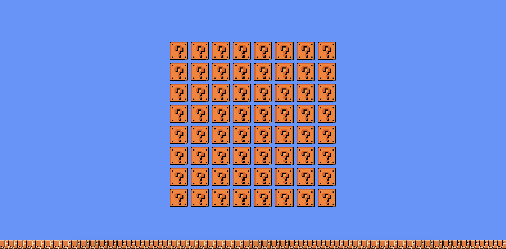
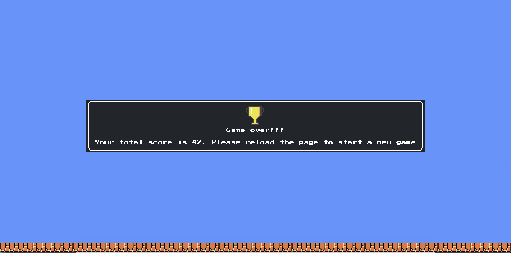

# diamond-sweeper 💎

## How to play?
- Player has to find 8 coins 💰 from 64 tiles.

- Once all 8 coins are collected, Game Over message with score will be shown.

## How to install?
- Clone this repo
- Build the docker image: `docker build -t diamond-sweeper .`
- Run the docker container: `docker run -p 3000:3000 diamond-sweeper:latest`
- In chrome open `http://localhost:3000/`

